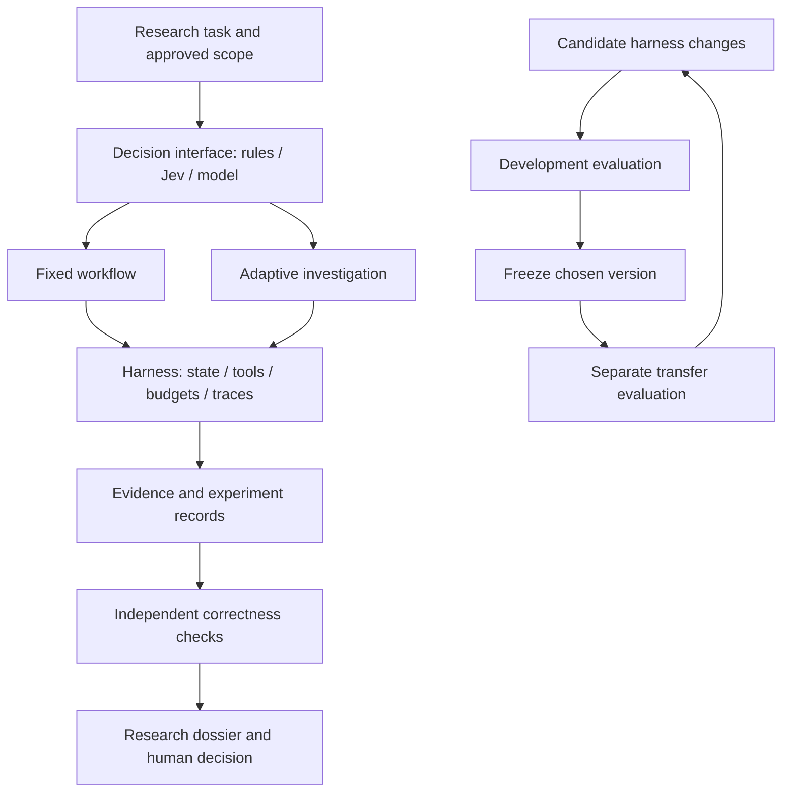

# Architecture and evidence boundaries

The final arrow indicates that using transfer results for another change consumes them. A new final claim then needs new untouched evidence.

## Minimum interfaces

`ResearchTask`: ID, question, evidence IDs and synthetic/public mode. `EvidenceRecord`: source, text, availability and version. `ExperimentSpec`: hypothesis, variant, seed, purpose and data version. `RunResult`: status, metrics, evidence, unresolved issues, resource use and versions. `CandidateChange`: hypothesis, edits and complexity. Definitions live in `signal_lab/core.py`.

The teaching examples also return simple dictionaries to keep notebook inspection easy. They do not impose a general production framework.

## Editable versus protected

| May change in a declared trial | Must stay fixed during that comparison |
|---|---|
| Routing prompt or decision rule | Task definition and labels |
| Inspection strategy | Source manifest and information cutoff |
| Evidence-checking procedure | Numerical validator and execution assumptions |
| Harness note or bounded tool workflow | Permissions, total budget and evaluation partitions |

The current implementation prevents accidental call-budget reset and step-identity changes. Candidate edits are fixed data, not executable patches. **It does not isolate a malicious or unrestricted agent from files.** Before running such an agent, provision an evaluator outside its filesystem/tool access; prompts saying “do not look” are not enforcement.

## Two evaluation loops

An agent-task score asks whether evidence, arithmetic and reporting are correct. A financial study asks whether a specified signal has predictive and implementable incremental value. Improving the first does not demonstrate the second. Public-document publication dates do not remove knowledge already stored in pretrained weights.

## Model layer

OpenRouter is an optional transport and model-selection layer under bounded tasks. It is neither the research evaluator nor the harness-evolution algorithm. Compare role-specific choices while freezing everything else; count controller, child, reviewer, retry and failed-call costs.
