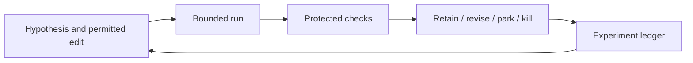

# Research loop and architecture

[Start](../../START_HERE.md) · [Roadmap](../ROADMAP.md) · [Sources](../SOURCES.md)

**Objective:** Separate a proposed experiment from the rules used to evaluate it.

**Prerequisites:** Basic Python functions and expected values.

**Main reading:** Karpathy autoresearch README: “How it works” and “Design choices”.

**Optional supplement:** Original guide §§1 and 6–7.

**Mode:** DEEP STUDY + TARGETED LAB. **Estimated effort:** 3 hours across several sittings, not one required sitting.

## Revision and worked example

Imagine hiring an analyst and giving them two things: a workspace in which they may try ideas, and a referee whose rules they may not change. The workspace contains the hypothesis and implementation. The referee checks whether the result answers the question honestly.

Karpathy's autoresearch gives this pattern a compact form: edit a training implementation, run a bounded experiment, inspect its validation result, retain or discard the change. In our lab, the transferable idea is a bounded experiment with recorded outcomes. We do not run GPU training or reproduce that repository.

### Why finance makes the referee harder

A model-training loss has a declared target. In finance, a high historical return can arise from using future information, entering at an unavailable price, excluding inconvenient assets or searching enough variants. The evaluator must test the meaning of the inputs and returns before ranking results.

**Synthetic example.** A company releases news after a 100 closing price. The earliest permitted entry is next morning at 104; the later exit is 105. The headline close-to-close return is 5%. The available gross trade return is `105 / 104 − 1 ≈ 0.9615%`. With an illustrative round-trip cost of 10 basis points of entry notional, it is approximately 0.8615%.

This is not a transaction-cost estimate. It is arithmetic showing why the entry definition belongs in the evaluator. An agent improving the result by swapping 104 for 100 has changed the experiment's meaning.

### Formal boundary

Write an experiment as `result = evaluate(candidate, fixed_data, fixed_rules)`. The candidate is allowed to change a declared part of the system. It cannot rewrite `fixed_rules`, select its own final labels or quietly change the universe. If the question changes, make a new specification before inspecting its result.

A research loop needs a hypothesis, a falsifier, an allowed edit, a resource limit, a result and a decision. A high score alone is not a complete experiment.

### The first lab

Notebook 01 computes the return independently, then uses the shared function. Change the **assumed round-trip cost**, keeping entry and exit fixed; observe what changes. Next inspect the deliberately invalid close-to-close comparison. These are two different interventions: one is an explicit sensitivity analysis, the other violates the availability rule.

A full Stage 1 sitting can allocate 35 minutes to this explanation, 35 to the selected source, 60 to the notebook and 50 to drawing and discussing the architecture. These are flexible estimates. Stop after the small example when tired.

### Common misunderstandings

- A failed hypothesis can be a successful research process if it was tested correctly.
- A protected evaluation script is not sufficient if its input dataset already contains future information.
- A model helping write regression code is different from that model's output entering a historical trading signal.
- A frozen seed improves reproducibility; it does not make an experiment economically meaningful.

## Connect it to the shared project

This is the common structure around all four modules. Jev-like decisions can choose an appropriate task route. RLM-style investigation can gather evidence. A harness executes the tools and persists work. RRSI addresses selecting changes to that harness. None replaces the economic and temporal checks.

The Baker discussion motivates organized responsibilities and critique before expensive search. It does not document Jump Trading's internal implementation. Cross-reference the original guide §§1, 5.2 and 7, plus the [Baker bridge](../BAKER_BRIDGE.md).

## Practical work

Open [notebook 01](../../notebooks/01-research-loop.ipynb). Its code is a worked starting point. Extend only the part we are currently studying; later lesson detail is developed together.

**Guided exercise:** Change only the entry assumption in the worked example; explain why the evaluator must reject an unavailable price.

**Completion evidence:** Identify what is editable, what is protected, and what would make the result invalid.

**Low-energy route:** read the worked example, inspect its output and leave the exercise for later. No quiz is required and no mastery update occurs automatically.

**Next-session expansion:** record the concrete question or confusing step in the learning record. The full lesson is expanded when we reach this module, rather than assigning every related topic now.
