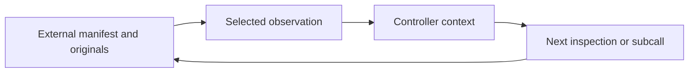

# Investigation: RLM

[Start](../../START_HERE.md) · [Roadmap](../ROADMAP.md) · [Sources](../SOURCES.md)

**Objective:** Trace external context, observations and decisions through a multi-document investigation.

**Prerequisites:** Stage 1; dictionaries, functions and metadata.

**Main reading:** RLM v1: Introduction, method and Table 1.

**Optional supplement:** Original guide §§3 and 6.

**Mode:** DEEP STUDY + TARGETED LAB. **Estimated effort:** 5 hours across several sittings, not one required sitting.

## Revision and worked example

A library may be available without being visible in the current prompt. A controller sees an index, opens a document, inspects a predecessor and revises its plan. External storage holds the originals; observations enter model context selectively.

The notebook compares reading the whole five-record manifest with a scripted two-read policy for issuer A. Both can support the same comparison. Issuer B has a missing predecessor, so the correct result is incomplete. Reading two records is sufficient for one question, not evidence of complete archive coverage.

This is a mechanism demonstration. The adaptive policy is ordinary Python with the next step fixed by metadata; it is not an RLM. A later live controller must choose inspections or subcalls from actual observations, and be compared under the same evidence and budget rules.

## Connect it to the shared project

RLM changes how an investigation navigates context. It can use retrieval and fixed processing as tools. Compare direct context, retrieval, fixed map/reduce and adaptive inspection before assuming recursion helps. Original guide §3 explains these alternatives. Keep deterministic joins and arithmetic outside prose reasoning.

## Practical work

Open [notebook 03](../../notebooks/03-investigation.ipynb). Its code is a worked starting point. Extend only the part we are currently studying; later lesson detail is developed together.

**Guided exercise:** Run issuer B and locate the missing predecessor; compare task coverage with archive coverage.

**Completion evidence:** Explain which information each call sees and why a scripted policy is not evidence about RLM performance.

**Low-energy route:** read the worked example, inspect its output and leave the exercise for later. No quiz is required and no mastery update occurs automatically.

**Next-session expansion:** record the concrete question or confusing step in the learning record. The full lesson is expanded when we reach this module, rather than assigning every related topic now.
