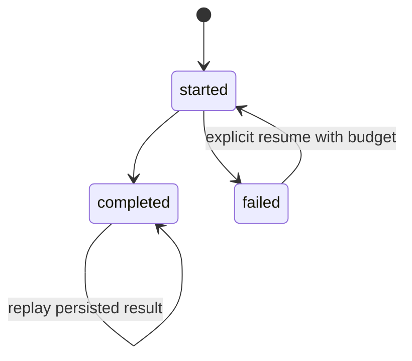

# Execution: harnesses and Prime Agent

[Start](../../START_HERE.md) · [Roadmap](../ROADMAP.md) · [Sources](../SOURCES.md)

**Objective:** Make a bounded investigation observable and recoverable.

**Prerequisites:** Stage 3; state and exceptions.

**Main reading:** Prime Agent: RLM/programmatic tools and Continual Harness sections.

**Optional supplement:** Original guide §4.

**Mode:** TARGETED LAB. **Estimated effort:** 5 hours across several sittings, not one required sitting.

## Revision and worked example

A harness is the surrounding machinery that turns model outputs into work: available tools, state, instructions, messages, permissions, budgets and records. Persistence matters when a task stops halfway through.

The local example registers deterministic functions, counts attempted calls including failures, persists completed outputs in SQLite and replays them after reopening. A reused step identifier with different inputs is rejected. A failed step requires explicit resumption and still consumes its earlier call budget.

A crash after an external side effect but before saving completion is harder. This runner makes no exactly-once guarantee and supports idempotent teaching tools only. It is also not an isolation boundary for arbitrary model-generated code.

Prime Agent's runtime includes persistent execution and child-session mechanisms. A child handle identifies work; it is not its eventual answer. Study these operational ideas before deciding whether the actual runtime solves a need in this small lab.

## Connect it to the shared project

Start with distinct proposer and reviewer responsibilities in a serial workflow. More agents are a later experiment, with all coordination cost counted. Keep source text untrusted, expose only bounded tools and preserve the evaluator outside candidate edits. Original guide §4 distinguishes runtime features from verified financial-research performance.

## Practical work

Open [notebook 04](../../notebooks/04-harness.ipynb). Its code is a worked starting point. Extend only the part we are currently studying; later lesson detail is developed together.

**Guided exercise:** Reopen a persisted run and replay a completed tool call; inspect failure and budget behavior.

**Completion evidence:** Distinguish dispatch, running, completed, failed and resumed work without double-counting calls.

**Low-energy route:** read the worked example, inspect its output and leave the exercise for later. No quiz is required and no mastery update occurs automatically.

**Next-session expansion:** record the concrete question or confusing step in the learning record. The full lesson is expanded when we reach this module, rather than assigning every related topic now.
