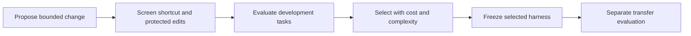

# Improvement: RRSI

[Start](../../START_HERE.md) · [Roadmap](../ROADMAP.md) · [Sources](../SOURCES.md)

**Objective:** Understand why selected development performance can diverge from transfer.

**Prerequisites:** Stages 4–5; model selection.

**Main reading:** RRSI v1: method, main comparisons and limitations.

**Optional supplement:** Original guide §4A; repository method-to-code map.

**Mode:** DEEP STUDY + TARGETED LAB. **Estimated effort:** 6 hours across several sittings, not one required sitting.

## Revision and worked example

If you repeatedly keep whichever prompt or tool change scores best on familiar tasks, the harness can learn those tasks even when model weights never change. RRSI studies ways to regularize that search; the relevant transfer is a discipline for proposing and selecting reusable changes.

Our counterexample compares four prewritten candidates: the base rule, a development-ID lookup, an evidence-reading rule and redundant extra review. The unregularized tie-break selects the ID shortcut. A simple shortcut screen and complexity tie-break select the evidence rule. The results follow from the constructed task generator.

This is RRSI-inspired design practice, not a replication. It omits model-proposed edits, the paper's changing edit budget, novelty exploration, noise-aware selection and interaction-aware pruning. The transfer fixtures are visible and consumed from the first run; repeated seeds would not manufacture fresh evidence.

For live research, compare frozen, unregularized and regularized search with matched backbone, candidate budgets and task sets. Keep final labels inaccessible to proposing agents. Count rejected candidates, failed runs and discovery cost.

## Connect it to the shared project

Original guide §4A preserves the full paper's qualifications. A lower development score can accompany better transfer, but that does not mean lower scores are desirable. The real question is reusable improvement. In quant research, uncontrolled agent search also increases the number of financial hypotheses tried; track both layers of selection.

## Practical work

Open [notebook 06](../../notebooks/06-evolution.ipynb). Its code is a worked starting point. Extend only the part we are currently studying; later lesson detail is developed together.

**Guided exercise:** Inspect the candidate shortlist and complexity tie-break; explain which paper mechanisms are absent.

**Completion evidence:** Distinguish a constructed teaching result, an RRSI-inspired experiment and a replication.

**Low-energy route:** read the worked example, inspect its output and leave the exercise for later. No quiz is required and no mastery update occurs automatically.

**Next-session expansion:** record the concrete question or confusing step in the learning record. The full lesson is expanded when we reach this module, rather than assigning every related topic now.
