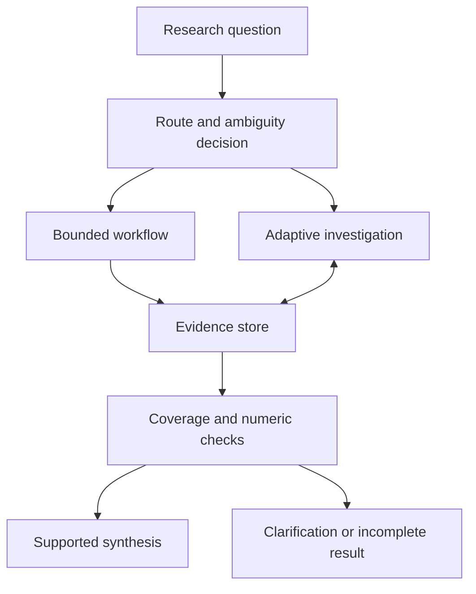

# Jev, Recursive Language Models and Prime Agent
## A study and implementation guide for Felipe

**Expanded edition:** RRSI and the generalization of harness improvements added on 24 September 2026. Original Jev/System One, RLM, Prime Agent, implementation and study material retained.

Prepared 24 September 2026 · Private study copy · Examples and proposed experiments are synthetic unless stated otherwise.

**The useful connection:** use a probabilistic decision model for bounded judgments, ordinary code for rules and calculations, and an LLM with programmatic context access for investigations that need flexible reasoning. The engineering question is which component earns its place through better measured outcomes.

This guide treats your “two models” as **Jev/System One** and **Recursive Language Models (RLMs)**. Prime Agent is an implementation of the second idea with additional runtime features. All four supplied links appear in the source register. The attached collection is also inventoried, with relevant readings selected rather than treating every book as a prerequisite.

### How to use this document

Read §§1–4 for understanding, §§5–8 for applications and implementation, then follow the study route in §9. Start with one public/synthetic research assistant. Do not rebuild your entire research platform to test these ideas.

Read **§4A** after Prime Agent for the RRSI connection: how to improve an agent's harness without simply fitting the evaluation tasks. Cross-references in §§6–7 connect it to implementation and testing; Session 7 is an optional 90-minute extension of the original study route.

Learning outcomes: explain the three layers accurately; turn probabilities into explicit decisions; distinguish an RLM from fixed chunk processing; design a fair comparison; and identify when neither new component is necessary. Your understanding remains **unassessed**; this guide does not alter your practice ledger.

## 1. What the links actually describe

| Item | What it is | Question it helps answer | What it does not establish |
|---|---|---|---|
| Jev | TypeSafe’s System One model | Which predefined outcome is supported by this state? | That the selected outcome is factually correct |
| System One | TypeSafe’s model category and decision interface | How can uncertain judgments become software inputs? | A complete research agent or a published reproducible architecture |
| RLM | An inference strategy around an underlying language model | How should a model inspect and reason over material larger than its working context? | Infinite attention, free computation or automatic completeness |
| Prime Agent | A coding/agent harness using RLM and Continual Harness ideas | How can long-running work, context and agent sessions be managed? | A separate foundation-model weight set or automatic investment-research validity |
| RRSI | An approach to regularizing harness evolution | Which proposed system changes are worth retaining? | A replacement for Jev/RLM or a guarantee of out-of-distribution improvement |

Jev’s launch describes typed decisions, parallel outputs and a training method named Reinforcement Learning for Calibrated Decisions (RLCD). It reports major speed and cost advantages on selected tasks. Its workflow evaluation uses other models’ probabilities as references, rather than independently established ground truth. Treat those results as vendor evidence, with workload-dependent gains. The linked material does not disclose enough to reproduce Jev’s training or architecture. [W2]

The original RLM paper places long input in a programming environment and lets an LLM inspect it and make subcalls. Its Table 1 includes cases where removing subcalls performs better, and cases where recursion helps. That is a reason to test the components separately. [W5]

**Source limitation:** the X link was indexed as “Jev Engineering: Stop Using LLMs for Every Decision,” but its full article could not be retrieved. It is included as the discovery source, not evidence for uninspected details. [W1]

## 2. Jev: learn to separate judgment from action

### 2.1 Start with a research request

Suppose a user asks: “Compare the language in the last three policy statements and plot inflation over the same period.”

There are several distinct jobs: interpret the request, obtain the right documents, resolve a data series, calculate the chart, and explain the result. A router only needs to decide which paths to invoke. It does not need to write the report.

TypeSafe exposes **Choice** for predefined alternatives, **Score** for rubric levels, and **Noul** for a proposition’s probability. Multiple questions can share the same state; the documentation says each is evaluated separately. Dependencies therefore belong in your code or in a later call using the earlier result. [W6]

For this example, a possible routing output is:

| Route | Synthetic probability |
|---|---:|
| Documents only | 0.05 |
| Data only | 0.02 |
| Documents and data | 0.91 |
| Clarification required | 0.02 |

This is an illustrative distribution, not a Jev measurement. Code can use it to choose the next step. A conventional classifier or structured-output LLM could expose the same application interface; Jev’s practical value must come from measured quality, speed, cost or reliability.

### 2.2 The familiar mathematics underneath

Let \(x\) be the available state, \(Y\) the correct category, and \(p_k(x)\) the model’s probability for category \(k\). Prediction provides a distribution. The application chooses an action \(a\) using a loss function:

\[
a^*(x)=\arg\min_a\sum_k L(a,k)p_k(x).
\]

With equal penalties for every wrong classification, select the most probable category. With different penalties, that rule can be wrong. Missing a required data lookup may be worse than doing an unnecessary extra lookup. This is the decision-theory distinction developed in Murphy §5.7. [A01]

**Worked example: review or accept.** Assume a wrong automatic decision costs 20 units, a correct decision costs zero, and review costs 1 unit and resolves the issue perfectly. If the probability of correctness is \(p\), automatic expected loss is \(20(1-p)\). Accept automatically only when \(20(1-p)<1\), so \(p>0.95\). At 0.91 the loss is 1.8 units; review is preferable under these assumptions. At 0.98 it is 0.4 units; automation is preferable.

The assumptions matter. Review can itself be wrong or slow; then include its residual error and delay in the comparison. The numerical threshold is not a suggested production setting.

### 2.3 Probability, confidence and calibration are different

TypeSafe’s Choice/Score `confidence` is a statistic derived from the output distribution. It is not separately observed evidence of correctness, and the documentation inspected does not specify its exact formula. Noul does not carry that field. Do not assume `confidence == max(probabilities)` or plug confidence directly into an expected-loss formula as a correctness probability. [W7]

Calibration asks whether reported probabilities match observed frequencies. Among comparable predictions near 0.8, does the designated event occur roughly 80% of the time? A perfectly calibrated model can still be unhelpful: always predicting the base rate may distinguish no cases.

For binary predictions, one useful score is:

\[
\operatorname{Brier}=\frac{1}{n}\sum_{i=1}^{n}(p_i-y_i)^2.
\]

It measures overall probabilistic accuracy, not calibration alone. Suppose all four probabilities are 0.8 and outcomes are \(1,1,1,0\). The score is \((0.04+0.04+0.04+0.64)/4=0.19\). Four observations cannot establish calibration. Use a larger held-out set, reliability plots with counts, and subgroup checks.

In macro documents, performance may differ by institution, language, period and document type. One aggregate reliability plot can hide a weak subgroup. Preserve uncertain labels where reasonable reviewers disagree; measure agreement before interpreting the model score.

### 2.4 What type safety buys you

A route restricted to `{documents, data, both, clarify}` cannot invent a fifth route if the interface enforces the schema. It can still choose `data` when the correct answer is `both`.

TypeSafe’s launch “no hallucination” argument concerns guaranteed schema matching. It is not a proof of semantic truth. [W2] In your application, separately check output structure, source coverage, factual support and whether the proposed action is authorized.

Independent evaluation of questions also does not mean the underlying events are statistically independent. If two answers give probabilities for A and B, multiplying them to estimate \(P(A\cap B)\) requires an independence assumption. A coherent workflow may instead ask a joint question or model the conditional relationship.

## 3. RLM: let the model work over the collection

### 3.1 The intuition

Imagine investigating a long archive with a notebook and a search index. You keep the archive intact, inspect selected parts, compute on tables, and return to the originals when necessary. You do not memorize every page before starting.

The distinction is between **available information** and **information currently shown to the model**. A Python object may hold millions of characters; those characters do not all enter the model’s prompt. A read-eval-print loop (REPL) executes code and returns selected observations. The model can use those observations to decide what to inspect next. [W5]

Keeping the archive available prevents some losses from irreversible summarization. It does not guarantee the model will discover the decisive passage. The notebook analogy fails if we imagine a perfectly diligent analyst: model-generated search plans and interpretations can be mistaken.

### 3.2 A worked investigation

**Synthetic task:** 240 policy statements across institutions. Identify every instance where the balance of risks changed, then relate those changes to data available at each release.

1. Build a manifest containing document ID, institution, publication time, version and text location. Extract text before reasoning; bad OCR remains bad evidence.
2. Let the controller inspect the manifest and a small sample. It chooses institution/date partitions and requests comparisons of adjacent releases.
3. Give a subcall the relevant original passages and an explicit task. Require document IDs, evidence spans, findings and unresolved ambiguity in its response.
4. Persist those results as rows. Use ordinary code to join dates and calculate changes; do not ask a model to count a long list from memory.
5. Audit coverage against the manifest. If 237 of 240 documents were processed, disclose three missing records rather than presenting a complete archive result.
6. Reopen original passages for disputed cases and test alternative interpretations.
7. Synthesize a report from the evidence table and numerical outputs. Preserve the table separately so the prose is inspectable.

These are proposed design choices, not a report of an existing implementation or benchmark result.

### 3.3 Distinguish four approaches

| Approach | Who controls the work? | A good test case | Typical failure to inspect |
|---|---|---|---|
| Direct long-context prompt | One model call sees the supplied material | A bounded, coherent source packet | Important details lost among distractors |
| Retrieval-augmented generation (RAG) | Retrieval selects evidence for generation | Find a specific source-supported answer | Required evidence never retrieved |
| Fixed map/reduce workflow | Code specifies partitions and aggregation | Apply the same rubric to every document | Cross-partition relationships disappear |
| RLM | The model controls inspection and subcalls through code | An investigation whose next step depends on findings | Poor decomposition, missed evidence, excessive work |

They can be combined. Retrieval can be a tool inside an RLM; fixed processing may prepare its evidence tables. Ordinary RAG is already appropriate for many questions. Use recursion when adaptive investigation adds value.

Writing a recursive Python function alone is not the distinguishing feature. The important mechanism is model-directed examination of external context, with sub-LM work available when useful. A developer-fixed loop over chunks is a useful baseline, but should be described as that baseline.

### 3.4 What the Prime RLM article adds

The January article describes a particular experimental implementation: tools beyond the REPL go through sub-LLMs, final output is stored in an answer variable, and printed observations are bounded. These are implementation choices, not universal RLM requirements. Its results include slower completion and tasks where the scaffold hurts performance. Its “main model token efficiency” excludes sub-LLM tokens; that metric is not total-system efficiency. [W4]

For your experiment, charge every child call, retry, sandbox and failed run. Do not equate a shorter controller context with a cheaper or faster system.

## 4. Prime Agent: the runtime around the idea

Prime Agent’s August launch describes a persistent IPython kernel, retained child sessions, messaging, recoverable history and a mutable harness containing prompt notes, skills, memory and subagent specifications. Its `rlm()` call returns a child handle; the child’s answer arrives through messaging. “Self-improvement” changes this harness state, not foundation-model weights. [W3]

That matters operationally: starting a task, waiting for it, collecting a result and detecting failure are different events. A program that interprets a child handle as its answer is incorrect.

**Proposed research use:** one session studies a data join, another reviews the transformation, and the parent checks their evidence against an independently computed fixture. This is a potential application, not something established about your previous work. Multiple agreeing agents can share the same misconception.

For a first experiment, freeze the harness. Later, test a proposed skill or memory change on a development set, retain its version, and evaluate once on untouched tasks. If the harness learns from the final evaluation set, the comparison is no longer held out. Keep rollback possible and prevent learned notes from changing permission boundaries.

The launch’s coding or reasoning benchmarks do not measure correct point-in-time financial research. For that, build tests with known data lineage and numerical answers.

## 4A. RRSI: improving the system without fitting the test

### 4A.1 Why it belongs here

**RRSI means Regularized Recursive Self-Improvement of Agent Harnesses.** Xia and colleagues' Google Cloud AI Research-led preprint, submitted 21 September 2026, studies changing the system around a frozen model. [W11]

The connection to our guide is most direct at the boundary between §4, Prime Agent's mutable harness, and §7, evaluating improvements. Here is the division of responsibilities:

| Layer | Existing concept | RRSI connection — proposed synthesis |
|---|---|---|
| Bounded judgment | Jev / System One | The rubric, thresholds or routing logic could be candidates for improvement; Jev itself need not be retrained |
| Solving the current task | RLM | Context inspection, decomposition and child-call policies could be edited and tested |
| Running the agent | Prime Agent | Prompts, skills, memory and control flow provide potential objects of change |
| Improving future behavior | RRSI | Regulate the proposal-and-selection process before changes become persistent |

The two uses of **recursive** refer to different loops. In RLM, an investigation can invoke smaller model tasks. In harness self-improvement, the current system's experience informs changes to the system used in later rounds. You can use either idea without the other.

A proposed Prime Agent–RRSI combination would put an evaluation gate around harness changes. This is an architectural suggestion, not a verified integration or an experiment reported in the paper. Likewise, Jev might eventually assist a narrow screening judgment, but there is no basis here for treating it as a validated replacement for the RRSI critic.

### 4A.2 The intuition: your test set can become training data

Imagine testing 100 variations of a research assistant on the same 30 questions. After each round, you inspect failures and rewrite its instructions. Even if model weights never change, the overall system is learning from those questions.

One revision might say “always include a comparison table,” because that worked on this collection. Another might memorize a series name that happens to answer several examples. The score rises, but a new question that needs a brief explanation or a different series exposes the weakness.

This resembles factor selection. Repeatedly trying transformations against one historical sample makes that sample part of the search process. Calling it an evaluation set does not restore independence.

For an intuitive mathematical sketch, write a candidate's observed score as

\[
\widehat S_j=S_j+\varepsilon_j,
\]

where \(S_j\) is its expected score on the task population of interest and \(\varepsilon_j\) is estimation noise. Choosing the largest observed score selects partly for positive noise. Under the deliberately simplified case of equal true scores and independent Gaussian errors with standard deviation \(\sigma\), the leading-order scale of the maximum noise is \(\sigma\sqrt{2\log M}\) for \(M\) candidates. Adaptive, correlated harness edits do not satisfy those assumptions; the expression illustrates the search effect, not a correction formula for RRSI.

There are two questions to ask of any improvement: **did this change cause a useful effect, and does that effect survive different tasks?** An edit ledger helps the first; an untouched transfer evaluation is needed for the second.

### 4A.3 What the method changes

The authors' project page describes two sets of controls. On the **proposal side**, the edit allowance shrinks over time, a history of hypotheses and outcomes guides later proposals, and stalled search is redirected toward previously unexplored components. On the **selection side**, a critic screens benchmark-specific content, acceptance accounts for evaluation noise and inference cost, and unproductive components become pruning targets. The editable harness remains broad; the constraints act on the search. [W12]

The paper's L0/L1/L2 language describes analogies to update sparsity, structural deletion and resource control—not ordinary coefficient penalties. Importantly, Appendix C.3 permits some within-noise-band changes using cost and structural novelty; it does not simply reject every small gain. [W11]

**How to interpret this in your own lab:** allow exploration early, then make changes easier to attribute. Preserve rejected hypotheses so the agent does not keep rediscovering them. Treat a new component as something that must earn its runtime cost. Keep critical correctness requirements outside any average-score tradeoff.

### 4A.4 Checking the Twitter summary

The quoted results match Tables 1–3. These are reported experimental scores, not measurements from our own runs. [W11]

| Method | Harvey evolve | Harvey held-out | JobBench | GDPval | APEX |
|---|---:|---:|---:|---:|---:|
| Base | 89.4 | 86.9 | 36.0 | 48.8 | 34.2 |
| Meta-Harness | 93.0 | 89.2 | 37.1 | 49.1 | 35.7 |
| RRSI | 90.5 | 89.2 | 40.7 | 52.3 | 37.9 |

RRSI is lowest among the five **evolved** methods on the evolve split, not below the base; it ties Meta-Harness on Harvey held-out. Reported tokens/trial are 2.42M versus 3.80M unregularized, but 1.56M for the base. The Gemini experiment reports 64.6→78.7 on Terminal-Bench and 76.8→79.0 on SWE-bench. [W11]

Several interpretations need care. “This prevents overfitting” is stronger than these experiments establish. The result supports a method for reducing that risk under the tested conditions. Held-out benchmarks are useful evidence of transfer, but they are still proxies for your own users, documents and data systems.

The token comparison also has a denominator: RRSI is cheaper than the unregularized evolved system in that ablation, not cheaper than the starting system. Nor does a policy-token figure include every possible cost of discovering and validating the final harness. A deployment decision should account for the optimization experiment itself as well as subsequent runs.

Finally, the same rank does not mean the same margin on every benchmark. Report each task family separately; an aggregate can conceal a regression in the part of the workflow that matters most to you.

### 4A.5 Worked transfer: improve your policy-research assistant

**Synthetic example, not Gavea history.** Your assistant handles one country's policy statements well. It often fails mixed questions requiring a statement comparison plus a vintage-correct time series. Consider three proposed changes:

| Proposal | Why it might score well | Evidence needed before retaining it |
|---|---|---|
| Always select the same inflation series | Reuses the answer common in the development questions | Reject the generic rule; resolve series using geography, definition and frequency |
| Require explicit geography, series definition and availability time before querying | Addresses a reusable semantic failure | Test unseen series, ambiguous requests and tasks that should require clarification |
| Run three extra reviewers on every answer | May catch mistakes through more computation | Compare marginal correctness, latency and total cost against targeted review |

The second proposal is a plausible reusable mechanism, but plausibility is not enough. It could create excessive clarification requests. Measure both prevented errors and newly introduced friction.

Hold out some institutions and document formats, not just random paraphrases from the same question family. For a time-based evaluation, keep future releases and their metadata out of the optimization process. Include direct lookups that should remain fast, and situations where a correct answer is “insufficient evidence.”

For factor research, apply the same discipline twice: first to the assistant that prepares the dataset, then to the predictive research that uses it. A better research harness does not establish alpha. Once humans or agents use a transfer result to choose another revision, that result has influenced development; obtain new untouched evidence for the next final claim.

For your study assistant, optimize for learning evidence: an independent explanation or transfer attempt after a delay. Longer answers, attractive formatting and your immediate satisfaction may be useful product signals, but they cannot by themselves establish retained understanding. Do not let automatic “improvement” rewrite a mastery ledger from generated examples.

### 4A.6 A practical outer loop to add later

The following is an **RRSI-inspired implementation plan**, not a reproduction of its complete acceptance algorithm:

1. **Freeze a baseline.** Record model, corpus, prompts, tools and permissions. Repeat unchanged runs to understand stochastic variability.
2. **Separate search from final evaluation.** Expose only development tasks to the proposer and critic. Keep final task files, labels and result summaries outside their accessible workspace.
3. **Specify candidate edits.** Each needs a hypothesis, a diff, affected components, expected benefit and potential regressions. Use a small fixed number of rounds for the first lab.
4. **Screen and execute independently.** Reject answer-specific shortcuts and changes to protected evaluation or permission code. Run candidates against the same fixtures and resource limits; record failures.
5. **Select with explicit criteria.** Judge score, repeated-run variability and cost together. Reject failures of required numerical or access-control checks even if the average score improves. State that these conservative lab rules differ from the full paper algorithm.
6. **Review retained complexity.** Remove a component only after checking its actual contribution and interactions; lack of positive evidence in a tiny sample is not proof it is useless.
7. **Freeze, then measure transfer.** Compare the selected harness with the original on untouched tasks. Report regressions, unsuccessful runs and total search expense. Retain the previous version for rollback.

For the original A–D experiment in §7, first choose an architecture using development evidence. Then compare its **frozen**, **unregularized-evolution**, and **regularized-evolution** versions under matched search budgets. This separates the value of Jev/RLM from the value of optimizing their surrounding workflow. Do not simultaneously change the backbone model: that would obscure attribution.

The official implementation uses a domain adapter, candidate git worktrees, an edit history and separate evaluation/selection modules. Its README maps paper mechanisms to code and documents baseline, run and status commands. [W13] These are useful reference points if you later build a local adapter. No service was installed and no autonomous optimization was run for this guide.

**What changes in the recommendation:** study this generalization problem now; implement automated evolution only after the fixed application and its evaluation are reliable. RRSI makes the existing advice to test harness changes more concrete. It does not make autonomous self-modification the first development step.


## 5. Where these fit your work

Your supplied Gavea brief describes document ingestion/retrieval, query decomposition and routing, warehouse questions and external information. It records unquantified performance and unresolved implementation details. The following are **proposed extensions**, not historical achievements. [A32 §§1–5, A39]

| Context | Candidate Jev role | Candidate RLM/Prime role | Deterministic responsibility |
|---|---|---|---|
| Research assistant | Route requests; identify ambiguity | Investigate across documents and data outputs | Access control, date filters, calculations, evidence IDs |
| Policy archive | Apply bounded language labels | Compare changes and resolve contradictions | Archive coverage, chronological joins, aggregates |
| Text-to-SQL | Choose among curated series candidates or request clarification | Inspect metadata and reconcile mixed questions | SQL permissions, grain, units, query limits and numeric validation |
| Factor research | Classify document evidence or research notes | Assemble a reproducible evaluation dossier | Return construction, temporal splits, costs, inference |
| Personal study collection | Suggest topic or difficulty labels | Compare explanations and build source-backed lessons | Source versions and an observed-learning ledger |
| Research coding | Triage a bounded issue category if it helps | Explore code, propose changes and run checks | Version control, independent fixtures and review |

### 5.1 Best first application: policy comparison plus a data chart

It exposes your relevant questions without requiring proprietary infrastructure. Use synthetic releases and a tiny data table first, then approved public material.



The shared evidence store is the important junction. Both paths must satisfy the same checks. A complex path does not receive a lower standard of evidence.

For GDP or inflation, a valid SQL query is insufficient: check level versus growth, monthly versus quarterly frequency, year-on-year versus annualized growth, seasonality, revised versus first-release data, and the requested geography. A typed series ID can still denote the wrong economic series.

### 5.2 Factor research: three different validation problems

A proposed text signal might encode how strongly an issuer discusses financing pressure. First validate whether the label reflects the text. Then test whether it predicts the specified outcome out of sample. Finally test whether the resulting portfolio adds implementable value. Success at one stage does not establish the next.

Use the private Factor Evaluation Outline’s four questions: economic rationale, prediction, implementation and additivity. [A05/A20] Add an information-availability audit: source publication time, ingestion time, model/version availability and portfolio decision time must all be explicit.

A modern pretrained model applied retrospectively may know later events. Restricting its prompt to old documents does not prove its weights are free of future information. Describe retrospective exercises accordingly; use controlled alternatives and prospective evaluation before claiming point-in-time predictability.

For a research assistant, judge time saved and correctness. For a trading signal, require incremental predictive and portfolio evidence after costs. They are different objectives.

## 6. Implementation, one component at a time

### Step 1 — Specify the evidence contract

Each evidence record should carry `document_id`, source location, publication and availability timestamps, version, original span and processing status. Each run should record question, configuration, model identifier, route, retrieved IDs, calls, costs, latency, failures and final claims.

For data results, also store query/template ID, series IDs, units, frequency, vintage and transformation. Store uncertainty and missing coverage explicitly. None of this requires a new model.

### Step 2 — Establish a small fixed baseline

Create 30–50 synthetic tasks with known answers: direct lookup, comparison, data-only request, mixed request, ambiguity, missing evidence and misleading source text. Include near-identical queries that differ in one consequential word, such as “latest” versus “available at the time.”

Use a deterministic workflow plus an ordinary structured-output model as the first baseline. Add a simple keyword or supervised classifier where meaningful. Small fixtures debug the system; they are not enough to certify rare-error rates.

### Step 3 — Replace only the judgment component

The current TypeSafe quick start documents `typesafe-sdk`, `TypeSafeClient.system_one`, and the REST endpoint `https://api.typesafe.ai/v1/systemone`. The example below adapts that interface to a synthetic router. It has not been executed against the service. Access credentials and applicable service terms remain prerequisites. [W8]

```python
from typesafe_sdk import Choice, TypeSafeClient

client = TypeSafeClient()  # Reads TYPESAFE_API_KEY from the environment.
result = client.system_one(
    state="Compare three policy statements and plot inflation for those dates.",
    questions={
        "route": Choice(
            instructions="Which information sources does this request require?",
            criteria={
                "documents": "Only written-source evidence is required",
                "data": "Only structured numerical data is required",
                "both": "Both written evidence and numerical data are required",
                "clarify": "Essential scope is missing or the request is unclear",
            },
        )
    },
)
decision = result.answers["route"]
print(decision.choice, decision.probabilities)
```

Route execution remains application code. Handle timeouts, absent results and invalid states with an explicit fallback. Keep logical ambiguity (“which country?”) separate from model uncertainty. A confident classification does not resolve missing scope.

Version the question/rubric as well as the model. A moving alias such as `jev-latest` is convenient for exploration but makes comparisons harder; record the resolved model identifier and use a fixed version when supported.

### Step 4 — Add programmatic context access before recursion

Give a controller read-only access to your manifest, text fragments and small computed tables inside an isolated execution environment. Begin with code-based search, filtering and aggregation. Observe which tasks still require semantic interpretation across many pieces.

The authors’ RLM package is installed as `rlms` and imported from `rlm`. Its default local REPL executes in the host process; the repository documents alternative environments including Docker. Do not confuse a Python namespace with an access-control boundary. Select isolation, mounts, network access and credentials deliberately. [W9]

### Step 5 — Introduce bounded subcalls

Define each task with input IDs, a narrow question and a return schema: findings, evidence IDs/spans, unresolved issues and status. Require terminal states such as succeeded, failed, timed out or cancelled. Never turn a missing child result into an empty successful finding.

Use a global budget shared across the entire call tree: cumulative tokens/cost, elapsed time, depth and concurrent calls. Check admission before dispatch, reserve expected work where possible, reconcile actual usage, and stop children on cancellation. A per-child budget alone can allow total cost to grow with the number of children.

For a toy lab, start with depth one and at most two concurrent children. Those are proposed learning constraints, not library defaults. Increase them only to address an observed failure.

### Step 6 — Combine only after separate evaluation

A hybrid could use Jev to label candidate passages and an RLM to investigate uncertain relationships. Keep a sample of rejected passages for audit: a cheap early filter can remove the decisive evidence before the reasoning model sees it.

If the task asks for every relevant event, a top-k retrieval result is not a coverage guarantee. Use a manifest-backed scan or an explicit strategy for estimating omissions. Measure the whole cascade; strong component scores do not necessarily compose into strong final answers.

**Later extension:** §4A.6 specifies how to evaluate proposed harness changes after this fixed implementation is working. RRSI acts on the improvement loop, not on each individual route decision.

### Step 7 — Try Prime Agent as a development harness

Use its official repository to set up a separate synthetic project, following the installation/authentication instructions current at execution time. [W10] Start with one bounded request, a fixed completion criterion and limits on time and turns. Inspect the trajectory, generated code and resulting evidence.

A passing completion command establishes only what that command checks. For financial-data work, include an independently prepared expected result and adversarial join/date cases. Delay automatic harness refinement until the fixed system is understood.

## 7. Evaluate the system like an experiment

Use a small factorial comparison so changes remain interpretable:

| Variant | Router | Investigation | What comparison tells you |
|---|---|---|---|
| A | Baseline | Fixed workflow | Reference performance |
| B | Jev | Fixed workflow | Marginal value of the new router |
| C | Baseline | RLM | Marginal value of adaptive investigation |
| D | Jev | RLM | Combined effect and possible interaction |

Within C, compare code access without subcalls against code access with subcalls. Hold corpus, task definitions, downstream model and evidence standard fixed where feasible. Use equal resource caps and also compare quality/cost frontiers; equal caps do not imply equal realized expenditure.

Split task families and paraphrase groups together to reduce leakage. For temporal tasks, use an appropriate time split. Tune prompts and thresholds on development data, then freeze them. Include unsuccessful runs in latency and cost reporting.

| Layer | Measure | What it diagnoses |
|---|---|---|
| Routing | Confusion matrix, mixed-route recall, abstention rate | Missing required tools or needless escalation |
| Probabilities | Brier/log loss, calibration plots, subgroup counts | Whether uncertainty is operationally useful |
| Retrieval/inspection | Gold evidence recall and manifest coverage | Missing sources and unprocessed partitions |
| Numerical work | Exact agreement on independent fixtures | Series, units, joins, timing and arithmetic |
| Synthesis | Supported-claim rate, completeness and contradiction handling | Whether prose follows the evidence |
| Operations | End-to-end p50/p95 latency, total cost, timeout/failure rate | User experience and operational feasibility |

A judge model may assist review, but do not let it define truth unchallenged. Check a human-labelled subset, adjudicate disagreements and use exact validators when possible. Report paired task differences and uncertainty; small samples support exploration rather than sweeping superiority claims.

**Synthetic latency example.** If only 10% of baseline wall-clock time is routing, even a 100× router speedup yields overall speedup \(1/(0.9+0.1/100)\approx1.11\). This assumes sequential work and unchanged downstream behavior. Conversely, a better router could improve total time substantially by avoiding unnecessary work; measure that effect separately.

**Harness-evolution extension:** apply the frozen/unregularized/regularized comparison in §4A.6 only after the original component comparison. Preserve an untouched final evaluation set across both stages; repeated inspection turns evaluation into development.

## 8. Failure cases worth building into the lab

1. **Correct schema, wrong route:** “What did inflation do?” lacks geography and period. A valid route cannot supply missing intent.
2. **Confident but wrong evidence:** a model confuses an expected policy change with an announced change. Require exact supporting spans.
3. **Independent labels, inconsistent combination:** separate judgments imply conflicting actions. Resolve consistency in application logic or ask a conditional question.
4. **Lost cross-document relationship:** a child sees one statement without its predecessor. Supply the comparison pair or request more context.
5. **Incomplete archive:** one parse failed. Preserve the failed record and qualify completeness.
6. **Prompt injection in a document:** source text tells the agent to ignore instructions or export files. Treat it as data; constrain actual capabilities outside the prompt.
7. **Runaway investigation:** the model keeps opening new questions. Enforce global budgets and allow an incomplete but evidenced answer.
8. **False learning:** a study assistant marks a topic mastered because it generated a good explanation. Update mastery only from observed attempts, assistance and later transfer.

## 9. A selective study route

**Provisional budget: 10 hours**, spread over one or two weeks. This includes reading, coding and review, assuming basic Python fluency and that API access is ready. Without access, mock the probability interface; that teaches decision logic but cannot validate Jev. Keep three active priorities: decision quality, context management and evaluation.

### Session 1 — Understand decisions: 75 minutes

**Objective:** distinguish model, inference strategy and harness; derive an accept/review rule. **Prerequisite:** conditional probability and expected value.

Read this guide §§1–2, then Murphy, *Machine Learning: A Probabilistic Perspective* (2012), §5.7 opening and §§5.7.1.1–5.7.1.2, printed pp. 176–178, PDF pp. 207–209. The title, section and page mapping were checked in your copy. **Mode: REFRESH.** This connects a new product interface to decision theory you can already reason about.

Spend roughly 20 minutes reading, 20 deriving the threshold with different losses, and 35 designing a routing rubric. **Completion:** explain why a valid category can be wrong and why changing error costs changes the action threshold.

### Session 2 — Implement and calibrate: 120 minutes

**Objective:** build a bounded probabilistic router and evaluate abstention. **Prerequisite:** Session 1 and simple API/JSON handling.

Main reading: TypeSafe Quick start, “Call it: the API” and “Code it: the Python SDK” [W8]. Supplement: “Confidence,” particularly “Confidence is derived from the probabilities” and “Thresholds scale with risk” [W7]. **Mode: TARGETED LAB.** These establish the actual interface and prevent misreading the confidence field.

Use 20 minutes for reading, 70 for a synthetic fixture and router, and 30 for an error table and Brier calculation. **Completion:** return a route or explicit fallback, record the model/rubric version, and show two cases where accuracy alone is insufficient. Calibration estimates from this tiny lab are illustrative.

### Session 3 — Understand context as data: 105 minutes

**Objective:** explain what enters the model context and what remains external. **Prerequisite:** Python slicing, dictionaries and functions.

Read the RLM paper v1 §1, §2.2, Table 1 and §5 [W5]. Optional supplement: the Prime RLM article’s “The RLM” and “Results across environments” [W4]. **Mode: DEEP STUDY.** Focus on the mechanism, baselines and limitations, not memorizing benchmark rankings.

Allocate 45 minutes to reading, 30 to drawing the state/context boundary, and 30 to designing a counterexample where fixed processing wins. **Completion:** trace one investigation and identify which observations each model actually sees; explain why no-subcall ablation matters.

### Session 4 — Build a bounded investigation: 150 minutes

**Objective:** compare deterministic processing with model-directed inspection. **Prerequisite:** Session 3 and basic debugging.

Main reading: authors’ RLM repository, “Quick Setup,” “REPL Environments” and trajectory logging [W9]. Supplement: this guide §6. **Mode: TARGETED LAB.** The repository connects the concept to execution and isolation choices.

Use 25 minutes for setup reading, 85 for a toy corpus with known cross-document relationships, and 40 to inspect traces and failure handling. **Completion:** preserve original evidence, detect a missing document, enforce a whole-run budget, and show at least one meaningful fixed-versus-adaptive difference. Do not claim an unexecuted adapter works.

### Session 5 — Make the architecture decision: 90 minutes

**Objective:** decide which components deserve further work. **Prerequisite:** results from the preceding labs.

Main reading: this guide §7. Supplement: Prime Agent’s “RLM and Programmatic Tool-Calling,” “Self-Improvement via the Continual Harness” and “Autonomous Mode for Evals” [W3]. **Mode: TARGETED LAB / CRITIQUE.** Runtime features matter only if they solve your observed problem.

Spend 20 minutes reading, 45 comparing variants, and 25 writing a one-page decision memo. **Completion:** recommend keep/remove/further-test for each component, with evidence, unresolved uncertainty and total cost/latency.

### Session 6 — Transfer to research: 60 minutes

**Objective:** separate extraction correctness from predictive and economic value. **Prerequisite:** the completed system sketch.

Read the four main gates in your private Factor Evaluation Outline [A05] and this guide §5.2. **Mode: REFRESH / TRANSFER.** Allocate 15 minutes to reading, 30 to an availability timeline, and 15 to checking the proposed validation design. **Completion:** identify one text-label error, one temporal-leakage risk and one implementation constraint that a model benchmark would miss.

### Session 7 — Does a harness improvement transfer? Optional 90 minutes

This extends the original 10-hour route to **11.5 hours**; it belongs within the existing evaluation priority, not a fourth concurrent project.

**Objective:** distinguish development-set improvement from reusable system improvement. **Prerequisite:** Sessions 3 and 5; familiarity with model selection. **Main reading:** RRSI v1 §§2–3, Tables 1–3 and “Limitations”; inspect Appendix C.3 if implementing the exact selection rule [W11]. **Optional supplement:** the official repository's “Method to code” table [W13]. **Mode: TARGETED READING / DESIGN LAB.** The purpose is to recognize adaptive overfitting before building an optimizer.

Spend 30 minutes reading, 20 checking the benchmark comparisons, 30 designing a frozen-versus-evolved test for your policy assistant, and 10 writing an acceptance/rejection decision for one synthetic candidate. **Completion:** explain why a lower evolve score can accompany better transfer; identify a benchmark-specific shortcut; specify one untouched transfer task family and one non-negotiable correctness check. This is design practice, not a claim to reproduce the paper within 90 minutes.

### What to study deeply, and what to defer

Study decision costs, calibration, evidence lineage, context management and independent evaluation carefully: these remain useful when products change. Learn API mechanics and orchestration through bounded labs. Use Murphy §§8.1–8.2, printed p. 245 / PDF p. 276, as an optional logistic-regression baseline refresher; that page was inspected. Use the other attached mathematics books only when a specific derivation blocks you.

Defer reproducing RLCD, training an RLM policy, continual self-modification and large agent swarms. The first is not reproducible from the inspected disclosure; the others add substantial experimental complexity before you have a baseline.

**First sitting:** Session 1 is sufficient. Its deliverable is a four-route schema and a justified accept/review rule, not a new platform.

## 10. Public source register

Links and implementation descriptions were checked on 24 September 2026. Documentation may change. Source summaries above are selective; applications, numerical examples, evaluation design and study exercises are this guide’s synthesis.

| ID | Source and exact reading | Role / access status |
|---|---|---|
| W1 | [0xwhrrari X post](https://x.com/0xwhrrari/status/2102020016539324501) | Supplied discovery link; indexed title/snippet only, full article inaccessible |
| W2 | [Diogo Almeida, Introducing System One Models & Jev](https://typesafe.ai/blog/introducing-system-one-models-and-jev), 15 Sep 2026; “Frontiers, Old and New,” “Workflow evals,” “Hallucination and Type-safety” | Vendor claims and their qualifications |
| W3 | [Prime Agent: A self-improving RLM agent](https://www.primeintellect.ai/blog/prime-agent), 5 Aug 2026; sections assigned above | Runtime and Continual Harness overview |
| W4 | [Recursive Language Models: the paradigm of 2026](https://www.primeintellect.ai/blog/rlm), 1 Jan 2026; “The RLM,” “Results across environments” | Experimental implementation and tradeoffs |
| W5 | [Zhang, Kraska and Khattab, Recursive Language Models, v1](https://arxiv.org/html/2512.24601v1), 31 Dec 2025; §§1, 2.2, 3, 5 and Table 1 | Original method, comparisons and limitations; specific version used for stable section references |
| W6 | [TypeSafe Introduction](https://docs.typesafe.ai/introduction), “TypeSafe primitives,” “Atomic questions, composed in code” | Decision interface |
| W7 | [TypeSafe Confidence](https://docs.typesafe.ai/confidence) | Meaning and use of confidence |
| W8 | [TypeSafe Quick start](https://docs.typesafe.ai/introduction/quickstart) | REST and Python interfaces |
| W9 | [Authors’ RLM repository](https://github.com/alexzhang13/rlm) | Implementation, execution environments and logs |
| W10 | [Prime Agent repository](https://github.com/PrimeIntellect-ai/prime-agent) | Installation and further implementation reference |

### RRSI sources added in the expanded edition

| ID | Source and exact reading | Role / access status |
|---|---|---|
| W11 | [Xia et al., RRSI: Regularized Recursive Self-Improvement of Agent Harnesses, v1](https://arxiv.org/html/2609.24972v1), submitted 21 Sep 2026; §§2–3, Tables 1–3, Appendix C.3 and “Limitations” | Method, reported comparisons and qualifications checked; preprint, no independent replication performed |
| W12 | [Authors' RRSI project page](https://regularized-rsi.com/), “The idea” and “Evolution explorer” | Accessible overview of the proposal and selection controls |
| W13 | [Official google-research/rrsi repository](https://github.com/google-research/rrsi), README “Method to code” and “Quickstart” | Implementation organization inspected; individual source-file execution not validated |

The user-supplied Twitter text prompted this addition. Its numerical claims were checked against the paper; it is not used as a substitute for the primary source. The RRSI discussion is integrated into §§1, 4A, 6, 7 and 9. All original material and attachment entries remain.

## Appendix — All attached materials: relevance and inspection scope

Every listed file was inventoried locally. Text was extracted from PDFs, the DOCX and the workbook; title/opening content was inspected for identification. That is **not** a claim to have read every book. Detailed use is confined to the sections named in the guide. A17 produced no usable text; the readable Markdown brief A32 supports the project discussion. No equivalence between their full contents is assumed.

| ID | Attached filename or verified identity | Role in this guide |
|---|---|---|
| A01 | ML Machine Learning-A Probabilistic Perspective.pdf — Kevin P. Murphy, 2012 | Core decision-theory reading; inspected selected text and contents |
| A02 | Empirical Asset Pricing via ML - Kelly et al 2022.pdf — Gu, Kelly and Xiu, *Empirical Asset Pricing via Machine Learning*, RFS 33 (2020), 2223–2273 | Finance-transfer background; filename’s 2022 is not the paper’s publication year |
| A03 | Default Corpbonds - He-Feng-Wang-Wu-2021.pdf — *Predicting Individual Corporate Bond Returns*, draft 19 Jun 2021 | Optional credit-prediction context; not identified as a default-model paper merely from filename |
| A04 | CreditMarkets overview - FED.pdf — *The Primary and Secondary Corporate Credit Facilities*, Staff Report 986, Sep 2021 | Credit-market background; not needed for these mechanisms |
| A05 | Factor evaluation outline .pdf | Read as private research-validation checklist; four principal gates used |
| A06 | Systematic Credit Investing.pdf — April Frieda | Optional credit implementation background |
| A07 | Econometrics questions 2021.docx | Refresher exercises; not assigned here |
| A08 | Style Investing in Fixed Income Markets.pdf | Optional factor context |
| A09 | Zhou - Active Equity Investing.pdf — Zhou and Jain, *Active Equity Management*, first edition 2014 | Reference for later portfolio work |
| A10 | Prob Stats - Sheldon Ross.pdf — *Introduction to Probability and Statistics for Engineers and Scientists*, third edition | Probability reference if needed |
| A11 | Mostly Harmless Econometrics - Angrist.pdf — Angrist and Pischke, March 2008 manuscript | Econometrics reference; not an LLM implementation source |
| A12 | Matrix algebra - stats book.pdf — Rencher and Schaalje, *Linear Models in Statistics*, second edition, 2008 | Targeted algebra reference |
| A13 | Matrix Calculus - Summary.pdf — Appendix D, “Matrix calculus” | Derivative reference; parent edition not established |
| A14 | Hansen - Time Series Expanded.pdf — Chapter 14, “Time Series” | Temporal-validation background; full edition not established |
| A15 | Instructors manual probability.pdf — Ross, *Introduction to Probability Models*, ninth-edition instructor manual | Solutions companion; not a standalone reading assignment |
| A16 | Course in Machine Learning.pdf — Hal Daumé III, second printing Jan 2017 | Optional baseline ML teaching; contents inspected |
| A17 | Gavea_AI_Project_Brief.pdf | No usable extracted text; not independently relied upon |
| A18 | Felipe_Quant_AI_Recruiting_Playbook.pdf, 16 Sep 2026 | Orientation and reading map inspected; no recruiting tasks added |
| A19 | Felipe_Quant_AI_Todoist_Import.xlsx | Planning artifact inventoried; no schedule or task changes |
| A20 | Factor evaluation outline .pdf | Byte-identical duplicate of A05 |
| A21 | 2023MT_Careers_MSc Maths and Computational Finance-handout.pdf | Careers material; defer for this study objective |
| A22 | Lecture_5.pdf — Jonathan Tam, Coding/algorithm complexity, 12 Nov 2025 | Optional coding background |
| A23 | Lecture 4.pdf — Brainteasers and more statistics, 5 Nov 2025 | Defer; not a prerequisite |
| A24 | Interview_Preparation lect 3.pdf — More linear algebra and statistics/linear regression, 29 Oct 2025 | Optional refresher |
| A25 | Lecture 2.pdf — Linear algebra, 22 Oct 2025 | Reference if needed |
| A26 | Interview_Preparation-2.pdf — Lecture 7, Data structures/Decision Trees, 26 Nov 2025 | Optional baseline/coding background |
| A27 | Lecture_8.pdf — Tree Ensembles/Deep Learning, 3 Dec 2025 | Optional baseline-model context |
| A28 | Buy side quant job advice - BAM CeO.pdf — Giuseppe Paleologo, *Buy-Side Quant Job Advice*, version 6 Sep 2025 | Careers reference; no role/title inferred from filename |
| A29 | Interview_Preparation - Slides.pdf — Lecture 1, Overview and brainteasers, 15 Oct 2025 | Defer |
| A30 | Interview Prep - Useful Docs.pdf, 7 Oct 2025 | Reference list; defer |
| A31 | lecture_6.pdf — Sorting algorithms/dynamic programming, 19 Nov 2025 | Optional coding practice; not required to understand RLM |
| A32 | Gavea_AI_Project_Brief.md, Sep 2026 | Main context source; §§1–5 inspected in detail; confirmed architecture distinguished from proposals |
| A33 | OpenAI_Quants_Practice_Ledger.md | Read to preserve evidence boundaries; no new mastery claims or edits |
| A34 | OpenAI_Quants_Interview_Prep.md | Opening scope inspected; not evidence of an employer’s interview format |
| A35 | Instructors manual probability.pdf | Byte-identical duplicate of A15 |
| A36 | Combinatorics.pdf — Ross, *A First Course in Probability*, eighth edition, Chapter 1 excerpt | Optional counting practice; defer |
| A37 | Interview Prep - Useful Docs.pdf | Byte-identical duplicate of A30 |
| A38 | Linear Algebra Done Right - Axler.pdf | Algebra reference; no edition-specific assignment made |
| A39 | Study_Project_Configuration.md, 20 Sep 2026 | Teaching priorities and privacy/progress boundaries |

The source collection supports several future routes, but this module needs only a small subset. The immediate task is to build an inspectable decision-and-evidence experiment, then let its results determine the next reading or engineering step.
