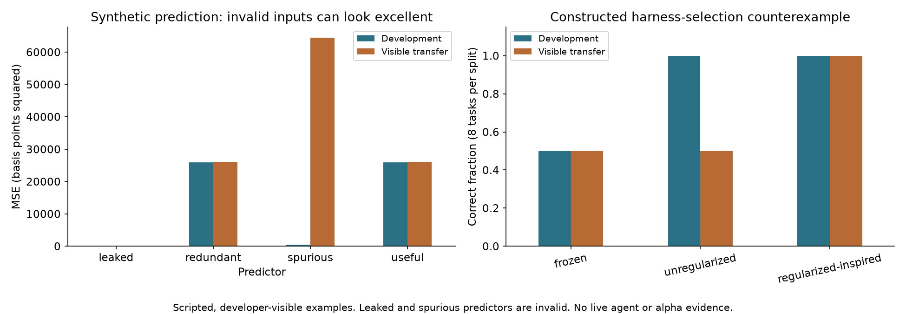

# Offline research demonstrator — initial evidence

[Start](../START_HERE.md) · [Experiment ledger](../docs/EXPERIMENT_LEDGER.md) · [Interview walkthrough](../docs/INTERVIEW.md)

The project now demonstrates the core boundaries using reproducible synthetic examples and public-source bookkeeping. **Live-model quality, RRSI effectiveness and financial predictability remain untested.**

## What the executed examples show

- **Decision costs:** the routing notebook turns supplied probabilities into accept/review choices. Its four invented cases cannot establish calibration or Jev performance.
- **Context access:** the fixed scan reads five records; the scripted selective policy reads two and answers issuer A's comparison. Issuer B's missing predecessor yields an incomplete result. This is not a measured RLM speedup.
- **Persistence:** the same completed calculation is replayed after reopening without another tool attempt. Failures and attempted retries count toward a persisted budget.
- **Timing:** the unavailable close-to-close return is 5%; the available gross return is 0.9615%; the net return under an assumed 10 bps round-trip charge is 0.8615%.
- **Additivity:** a duplicated useful predictor changes later-period MSE by 0.00e+00, numerical zero. This is a linear-algebra example, not a general rejection rule for correlated signals.
- **Public evidence:** 12/12 releases have source-specific revenue/net-sales extractions. Current copies and date-only metadata do not establish intraday historical availability.

## Harness selection

| Method | Selected candidate | Development | Visible transfer | Added complexity |
|---|---|---:|---:|---:|
| frozen | base | 50% | 50% | 0 |
| unregularized | memorize | 100% | 50% | 1 |
| regularized-inspired | check-evidence | 100% | 100% | 1 |

The construction makes the task-ID shortcut look good on development and fail to transfer. The regularized-inspired selector rejects that shortcut and avoids redundant review. These outcomes are designed into the example, not empirical support for RRSI. The transfer set is visible and consumed. Deterministic repetition has no informative stochastic uncertainty.

## Component decisions

| Component | Current decision | Evidence needed next |
|---|---|---|
| Deterministic calculation and evidence checks | Keep for the learning lab | Extend independent cases as behavior expands |
| Decision interface | Keep; Jev untested | Labelled tasks and a fair rule/classifier/model comparison |
| Adaptive investigation | Further test | Live controller versus fixed/retrieval baselines at matched budgets |
| Persistent harness | Keep for local idempotent tools | Actual async isolation and recovery tests before broader tools |
| RRSI-inspired selection | Keep as a teaching example | Independent live task families and the full declared search protocol |
| OpenRouter model mix / diffusion | Further test; no completions run | Approved budget, pinned providers, quality and total-cost measurements |
| Financial signal | Park | Admitted point-in-time data, explicit target, independent prediction/cost/additivity evidence |

## Limits and provenance

Run source: `reports/final-offline`. Inspect its `experiment.json`, `provenance.json`, `results.json`, `predictor_results.csv` and synthetic panel. API completions: **0**. Paid API spend: **$0**. Public web downloads and the unauthenticated catalogue request are separate from model calls.

No finding here demonstrates learner mastery. Full lessons are expanded progressively. The first useful next step is [Lesson 1](../docs/modules/01-research-loop.md), not a larger agent fleet.
